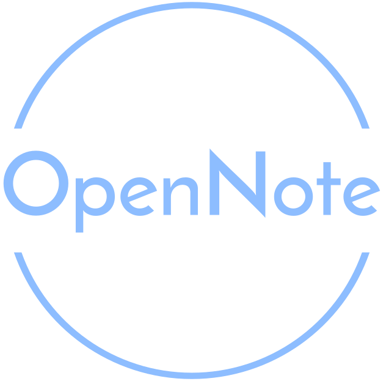

<!-- Improved compatibility of back to top link: See: https://github.com/othneildrew/Best-README-Template/pull/73 -->

<!-- PROJECT LOGO -->
 

  

  <h3 align="center">OpenNote</h3>

<!-- ABOUT THE PROJECT -->
## About The Project

<!-- [![Product Name Screen Shot][product-screenshot]](https://example.com) -->

An open source, extensible, cross-platform alternative to Microsoft's OneNote software.

App Features:
* Move and resize any textbox, image, table, or custom widget
* Unlimited pages, with nested child pages
* Unlimited sections with unique content per page
* Autosave
* Clipboard and undo
* Screensnipping
* A plugin system that makes adding your own editor widgets easy

<!-- GETTING STARTED -->
## Getting Started

### Downloading and Using
Simply find an appropriate release for your operating system under the "Releases" section. Once downloaded, run the OpenNote executable and the program will start.

### Development

Simply clone the repo locally, install all required pip packages from the requirements.txt, then the project can be run from main.py.
See docs\ for documentation on how to implement custom widgets, and how the program works at a high level.

(<a href="#readme-top">back to top</a>)

